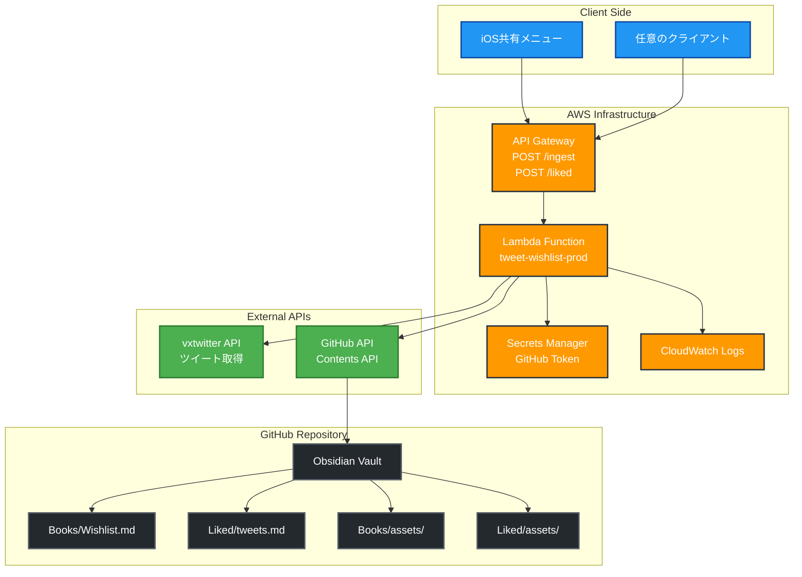

# Tweet Wishlist Writer

AWS Lambda + API Gateway + Terraformによる、TwitterツイートからObsidian Vaultへの書籍ウィッシュリスト自動追加システム。

## 機能

- iOSの共有メニューや任意クライアントからTwitter/X URLを受信
- vxtwitter APIを使用してツイート本文・画像を取得
- GitHubのObsidian Vaultリポジトリ内の`wishlist.md`に自動追記
- いいねしたツイートを別ファイル（`Liked/tweets.md`）に保存可能
- 画像ファイルを`assets/YYYY-MM/`に自動アップロード
- 競合回避機能（指数バックオフリトライ）
- 元のツイートリンクを保存形式に含む

## アーキテクチャ



## セットアップ

### 前提条件

- AWS CLI設定済み
- Terraform 1.0以上
- Python 3.12
- GitHub Personal Access Token（`repo`権限）

### 1. 依存関係のインストール

```bash
# Python依存関係
cd app
pip install -r requirements.txt

# 開発・テスト用
pip install pytest boto3-stubs ruff
```

### 2. 設定ファイルの準備

```bash
# Terraform設定
cd infra
cp terraform.tfvars.example terraform.tfvars
```

`terraform.tfvars`を編集：

```hcl
# AWS Configuration
aws_region = "ap-northeast-1"

# Project Configuration
project_name = "tweet-wishlist"
stage        = "prod"

# GitHub Configuration (Required)
github_owner  = "your-github-username"     # あなたのGitHubユーザー名
github_repo   = "your-vault-repo"          # VaultリポジトリName
github_branch = "main"

# Vault Paths - Books
vault_wishlist_path = "Books\\Wishlist.md"  # ウィッシュリストファイルパス
vault_assets_dir    = "Books\\assets"       # 画像保存ディレクトリ

# Vault Paths - Liked Tweets
vault_liked_path       = "Liked\\tweets.md"    # いいねツイート保存パス
vault_liked_assets_dir = "Liked\\assets"       # いいねツイート画像保存ディレクトリ

# Lambda Configuration
lambda_timeout     = 60
lambda_memory_size = 512

# Logging
log_retention_days = 30
```

### 3. デプロイ

```bash
make deploy
```

または手動で：

```bash
cd infra
terraform init
terraform plan
terraform apply
```

### 4. AWS Secrets Manager設定

デプロイ後、Secrets Managerに機密情報を設定：

```bash
# Secrets名を取得
terraform output secrets_name

# AWS CLIで設定
aws secretsmanager update-secret --secret-id "tweet-wishlist-prod-secrets" \\
  --secret-string '{
    "GITHUB_TOKEN": "your-github-personal-access-token",
    "API_KEY": "your-optional-api-key-for-client-auth",
    "GITHUB_OWNER": "your-github-username",
    "GITHUB_REPO": "your-vault-repo",
    "GITHUB_BRANCH": "main"
  }'
```

もしくはAWSコンソールから設定：
1. AWS Console → Secrets Manager
2. `tweet-wishlist-prod-secrets`を選択
3. "Retrieve secret value" → "Edit"
4. 上記JSONを貼り付け

### 5. API動作確認

```bash
# エンドポイントURL取得
terraform output api_invoke_url

# テスト実行
curl -X POST "https://your-api-id.execute-api.ap-northeast-1.amazonaws.com/ingest" \\
  -H "Content-Type: application/json" \\
  -H "X-Api-Key: your-optional-api-key" \\
  -d '{
    "url": "https://x.com/user/status/123456789",
    "note": "読みたい本"
  }'
```

## API仕様

### POST /ingest

書籍関連のツイートをウィッシュリストに追加

### POST /liked

いいねしたツイートを保存

**Request:**
```json
{
  "url": "https://x.com/user/status/123456789",
  "note": "任意のメモ（最大500文字）"
}
```

**Headers:**
- `Content-Type: application/json`
- `X-Api-Key: <optional>` （設定した場合）

**Response (成功):**
```json
{
  "status": "success",
  "message": "Tweet added to wishlist",
  "tweetId": "123456789",
  "commits": [
    "assets/2024-01/123456789_1.jpg",
    "wishlist.md"
  ]
}
```

**エラーレスポンス:**
- `400`: 入力不正（URL欠落、形式不正）
- `401`: 認証エラー（API Key不正）
- `409`: 競合エラー（同時更新、リトライ推奨）
- `422`: ツイート取得エラー、画像なしなど
- `502`: vxtwitter API到達不可
- `503`: GitHub API障害

## 出力形式

### 書籍ツイート（`wishlist.md`）

```markdown
- 2024-01-15 [@username](https://x.com/username/status/123) note: 読みたい本
  - text: |
    ツイート本文の1行目
    ツイート本文の2行目
  - original: https://x.com/username/status/123
  - images:
    - ![[assets/2024-01/123_1.jpg]]
    - ![[assets/2024-01/123_2.png]]
```

### いいねツイート（`Liked/tweets.md`）

```markdown
- 2024-01-15 [@username](https://x.com/username/status/456) note: メモ
  - text: |
    ツイート本文
    複数行の場合はこのように表示
  - original: https://x.com/username/status/456
  - images:
    - ![[Liked/assets/2024-01/456_1.jpg]]
```

## 開発

### テスト実行

```bash
make test
```

または：

```bash
cd tests
python -m pytest -v
```

### コード品質チェック

```bash
make lint
```

### ローカル開発

```bash
# 環境変数設定
export SECRET_NAME=tweet-wishlist-prod-secrets
export AWS_REGION=ap-northeast-1
export GITHUB_OWNER=your-github-username
export GITHUB_REPO=your-vault-repo
export GITHUB_BRANCH=main
export VAULT_WISHLIST_PATH="Books\\Wishlist.md"
export VAULT_ASSETS_DIR="Books\\assets"
export VAULT_LIKED_PATH="Liked\\tweets.md"
export VAULT_LIKED_ASSETS_DIR="Liked\\assets"

# ローカルテスト（mockを使用）
python -m pytest tests/
```

## 障害対応

### 409エラー（競合）が頻発する場合

- 複数のクライアントから同時実行している可能性
- リトライ間隔を調整（Lambda内の指数バックオフ）
- ファイル分割を検討（月別ファイルなど）

### 502エラー（vxtwitter API）

- vxtwitter APIの一時的な障害
- 数分後に再試行
- ツイートが削除された可能性

### GitHub API制限

- Personal Access Tokenの権限確認
- レート制限（5000 requests/hour）
- リポジトリが存在し、権限があることを確認

## Makeコマンド

```bash
make help        # ヘルプ表示
make plan        # Terraform plan
make deploy      # Terraform apply
make destroy     # Terraform destroy
make test        # テスト実行
make lint        # コード品質チェック
make clean       # ビルド成果物削除
```

## アーキテクチャ詳細

### セキュリティ

- GitHub Personal Access Tokenは最小権限（`repo` または `contents:write`）
- API Keyによる認証（任意）
- CloudWatch Logsによる監査ログ
- 個人情報のログ出力を抑制

### パフォーマンス

- Lambda ARM64アーキテクチャ（コスト効率）
- 指数バックオフによる競合回避
- HTTP接続プーリング（requests.Session）
- 適切なタイムアウト設定

### 冪等性

- 同一画像の重複アップロード回避
- ファイル存在チェック
- 安全なリトライ機構

## トラブルシューティング

### よくある問題

1. **GitHub認証エラー**
   - Personal Access Tokenの有効期限確認
   - リポジトリの存在と権限確認

2. **Lambda タイムアウト**
   - 大きな画像ファイル処理時
   - `lambda_timeout`を増加（現在60秒）

3. **ツイート取得失敗**
   - 削除されたツイート
   - プライベートアカウント
   - vxtwitter API一時障害

4. **ファイルパス設定**
   - Windows形式パス（`\\`）とUnix形式（`/`）に注意
   - リポジトリ内の実際のディレクトリ構造と一致させる

## ライセンス

MIT License

## 開発者

熟練クラウドエンジニア × フルスタック開発者